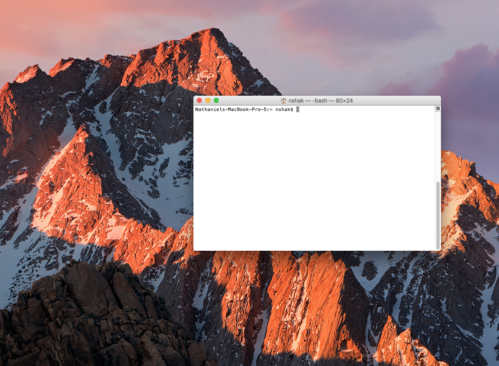

# Setting up Python 2 on Mac

This tutorial is just going to be a bunch of following instructions. In the process of this, you will be introduced to **the terminal**, a mysterious and scary being that every young coder will one day encounter. As you go through this tutorial, *don't be afraid to stop and mess around with things for the heck of it*. If you're curious about something that I didn't explain well, **Google it**! As you will soon learn, a large portion of coding is learned through Googling and playing around with things. *Anyways, let's get started!*

**Open the terminal**. You should be able to find it by just pressing "command-space" and typing in "terminal". One you have it open, it should look something like this:

*What is that?!*

Yes, I know, it looks scary. I remember feeling a mixture of extreme fear and the feeling that I was doing some hardcore hacking of a government system or something the first time I used the terminal. I'll explain more about what this is later. In the meantime, see what happens if you hit "command-i" and mess around if you want to feel even more like a hacker. By the end of this class, you and the terminal will be good friends.

* **Install Homebrew**. Alright, ready for some fun? You don't really need to know what Homebrew is, but if you're curious, it's software that helps us easily install and manage other software. This will actually be useful whether or not you need to install Python.

Go ahead and copy/paste the following into the terminal:

    /usr/bin/ruby -e "$(curl -fsSL https://raw.githubusercontent.com/Homebrew/install/master/install)"

then press "enter".  

*Whoaaa, that looks crazy right?*  

Go ahead and wait for the terminal to stop spitting out random text, then we can continue to the next step.

* **Check your Python version**. Type the following into the terminal: 

    python --version

then hit "enter".

It should either say something like:

    Python 2.x.xx

(where the x's are numbers) or:

    -bash: python: command not found

In the first case, it means you already have Python 2 on your computer. **That means we're good, and you can actually [continue on with the lesson](README.md)**. In the second case, we don't have Python set up yet, so let's do that.  

This is unlikely, but if, by chance, you see something like this:

    Python 3.x.xx

That means you have Python 3 set up instead of Python 2, in which case you should either talk to a mentor to change it to 2 (which will be a bit more complicated) or just go on with it. There are some minor syntactical differences between 2 and 3 (mostly the "print" statements), but most of the differences won't be super noticeable.  

*Okay, let's continue*.

* **Install Xcode Command Line Tools**. You don't need to know what this is. Pretty much, we need it for Python to work.  

You know the drill now, just paste this into the terminal:

    xcode-select --install

and hit "enter" again.

If it says something like:

    xcode-select: error: command line tools are already installed, use "Software Update" to install updates

Don't worry about it. Just continue. Otherwise, click through the next couple dialogue boxes and install the software.

*Okay, we're almost there*.

* **Install Python**. More typing things we don't understand into the terminal. Yaaay. You know the drill. Put this in the terminal and hit "enter":  

    brew install python

Okay, after the terminal finishes going crazy from that last command, you should be good. You can check to see if it all worked by typing:

    python --version

in the terminal and pressing "enter". If the following shows up:

    Python 2.x.xx

You're good! Go ahead and [continue with the lesson](README.md). If not, check with a mentor.