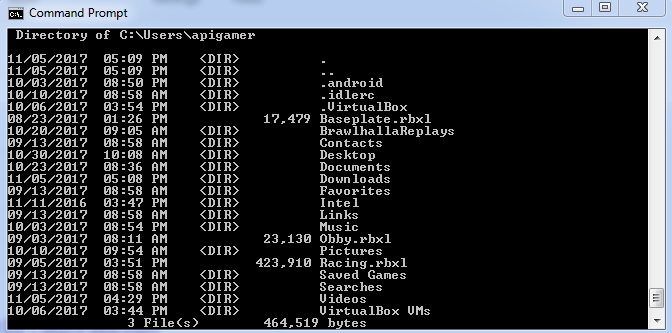
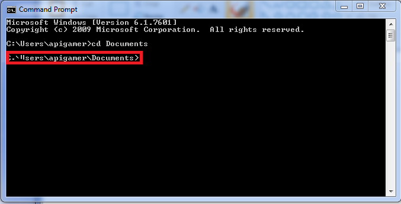
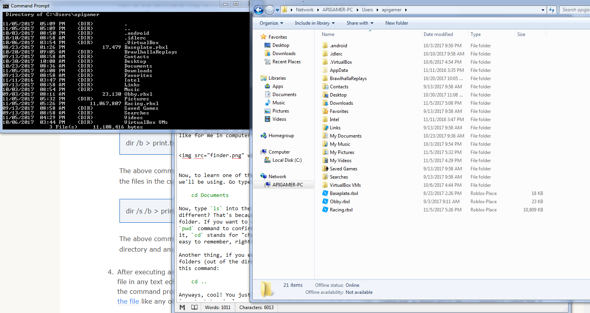
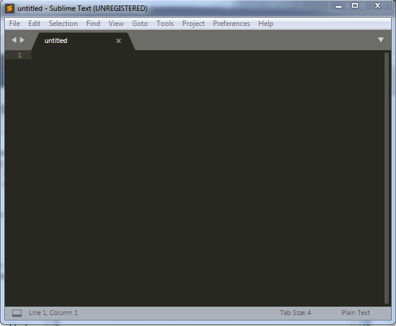
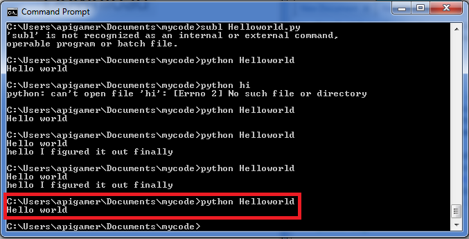

# Our First Python Program and Using the Terminal

Okay! You made it this far! Now, we get to write our first program in Python. Before we do that though, we need to get a bit more acquainted with our scary but useful friend, the command prompt.

 

> (This actually isn't at all what working with the command prompt looks like. It's just what it feels like the first couple times you use it.)

## So, what is the command prompt?

The first couple times I had to use the command prompt, I thought of the movies where you see hackers frantically typing in their keyboard as green text frantically sprays up the screen over a black background and wondered if that was it was going to be like. Spoiler alert: it's not.  

Here is a dictionary definition of the command prompt, according to dictionary.com:

> Any device for entering information into a computer or receiving information from it.  
 
That's a bit vague, but essentially all it is. It's a way of us interacting with the computer in a different way than clicking and scrolling through windows. In some ways, it's more limited and difficult to use, but in other ways, as you'll learn throughout this class, it makes things a lot easier and gives us much more capabilities, especially for things involving programming.  

So let's go ahead and learn some of the basics.  

Type `dir` into the command prompt and hit "enter".  

You should see something that looks like this:

*What just happened?*

`dir` stands for "directory", and what you just did is list all the files of the directory you're currently in. On the top of the listed directory it will tell you the path you took and which directory you are currently in. It will look something like this:

And if you open up computer tab and look in that same folder that you're in in the command prompt, you should see matching folders and files to what was printed out by `dir`. The command prompt is actually a lot like a text version of the Finder in many ways if that makes it easier to think about.  

Just to prove it to you, here's what that folder looks like for me in computer tab:  

Now, to learn one of the most important terminal commands we'll be using. Go type this command into the command prompt:

	cd documents
	
Now we are in the "Documents" folder. If you want to confirm that, look next to where you enter your commands. The last folder name listed next to the > is the current directory your in.

Another thing, if you ever want to go up a level in folders (out of the directory you're currently in), use this command:

	cd ..
	
Anyways, cool! You just learned a couple of the most important terminal commands for navigating around. Feel free to take some time using `cd` and `dir` to navigate all over the place while feeling like a [real hacker](http://geektyper.com/tegnio/).  

>Protip: if you are really deep into the command prompt you can jump out of multiple directories in one line like this. `cd ..\` this is one level. `cd ..\..\`this is two.

Here's a list of the commands we've learned so far, just so you remember:

Command  | Function
------------- | -------------
dir  | list files and directories
cd  | change directory

> Protip: as you're in the middle of typing file and directory names, try pressing tab. This will caues the command prompt to autocomplete what you're typing if you've typed enough letters for it to narrow down what you're typing. Pretty cool, right?

Once you're bored of cding and diring around, it's time for

## Creating your First Python Program

Go ahead and navigate to your Documents folder (or whatever other folder you'd like to do this in). Now, type the following command:

	mkdir mycode
	
If you use `dir` again, you'll see that a folder called "mycode" now exists. That's because the `mkdir` command allows you to make a new directory. Go ahead and cd into that new folder you just created.

Now, we're going to need to install a program called Sublime Text 3. Use [this link](https://www.sublimetext.com/3) to download it. Download the windows version. After you finish installing the text editor you should get a window like this.

In the editor type in `print "Hello world"` then go to the top left of the window and click save as. Navigate your way into the directory you just made in the Documents folder and save it as `Helloworld.py`. 
	
From there go back to the command prompt and find your way into that same directory. once inside that directory type `python Helloworld.py` and it should output something like this!

Meaning the computer ran your program, and you're seeing the output of that program. Congrats, you just wrote your first program! That's all for this lesson!

[Click here to move on to Lesson 2](../Lesson2)