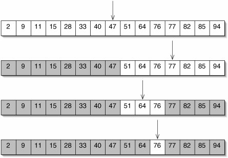

# Lesson 5: Searching and an Introduction to Algorithmic Analysis

**To start this lesson, students should:**

**By completing this lesson, students will:**

## Searching through a Phonebook

To start with, imagine you're trying to find someone's name in a phone book. For the sake of this example, let's imagine that there's no table of contents showing the page number of each letter section. Also for the sake of this example, let's pretend that we have no idea the numerical distribution of the starting letter of names are across the phone book - for all we know, there might be no names starting with the letters "A-P", making the first name in the phonebook start with the letter "Q" or every name in the phonebook might start with the letter "A". Who knows? All we know is that the names are sorted in alphabetical order.

There's a couple strategies we could take here. 

### Linear Search

The most straightforward way to do this would be to start at the very beginning of the phonebook, then flip page by page until you find the name. It's guaranteed to work - you know you'll find it *eventually*. It's just that it might take a very long time.

If drew a metaphor between this and coding, we could say the phonebook is equivalent to a list of sorted numbers, and we're trying to find the index of the list a certain number is at. The coding equivalent of looking through every page in the phonebook until we found what we were looking for would be something like this:

	def linear_search(phonebook, desired_name):
		for page in range(len(phoneboook)):
			if phonebook[page] is desired_name:
				return page
		
That seems pretty simple. It's an elegant solution that really doesn't take that much code. This solution is actually a well-known algorithm called **linear search**.

However, let's imagine the phonebook is a thousand pages. What about ten thousand pages pages. A million pages even. How many pages are we going to end up going through? I guess the only thing we can say for sure is: *at worst*, we'd go through all the pages in the phonebook. Now, we still know we'll find the name for sure, but **can we do better?**

### Binary Search

One thing that **linear search** never took advantage of was the fact that our phonebook had all the names sorted. How could we take advantage of this information to speed up our search?

Well, for one, what if we started from the very middle of the phonebook? If we got there and the names on that page were "lower" than our desired name, we could actually throw out the bottom half of the phonebook and repeat the process with our remaining half of the phonebook. Now let's look at the middle of our remaining half of the phonebook. If the names on that page are higher that the name we're looking for, we can also take that top quarter of the phonebook above the page and also throw it out. In fact, if we repeat this process over and over, we'll eventually get to our desired name likely much faster than we would have going page by page. 

> [Click here to see a video demonstrating this.](https://www.youtube.com/watch?v=o2LqhHoAXxI)
 
How fast will we get there? In linear search, we knew that *at worst* we'd have to check every page. In binary search, we know that every time we check a page, we divide the number of possible pages the name could be on in two. That means, in the worst case, the number of pages we'd have to check would be how many times we'd have to divide the original number of pages in two before reaching one. Mathematically speaking, that would be: log2(N) where N is the number of pages in the phonebook.

While it might be hard to see how much a difference this makes at first, for large numbers of pages, this makes a **huge** difference.

Here's a table to show us the difference in how many pages each algorithm would have to check at most:

|Linear|Binary|
|-----|----|
| 10 | 3 |
|100 | 7 |
|1000| 10|
|1,000,000|20|
|1,000,000,000|30|

Wow, that's a big difference, and it shows an important concept in programming. Even if something works, *there could always be a way to do it better*.

### Let's code it up

If you open up exercises.py, you'll see the following code:

	#searches linearly through a sorted list of numbers: nums for a number: target and returns whether or not the list contains the number
	def linear_search(nums, target):
		for num in nums:
			if num is target:
				return True
		return False
	
	#uses binary search to go through a sorted list of numbers: nums for a number: target and returns whether or not the list contains the number
	def binary_search(nums, target):
		#TODO: implement this!
		return False

If you look at the first function, we've already implemented linear search for you. In this case, we want to check *whether or not* a number exists in a sorted list, then return `True` or `False` depending on if it is or not. Your job is to implement the binary search portion based on what we described above.

Here is a diagram of what binary search would look like on a list of sorted numbers if you were looking for the number, "76".

> The arrow represents which number you're checking at any given point and comparing to the number you're looking for before choosing which half to look into.

## Algorithmic Analysis
